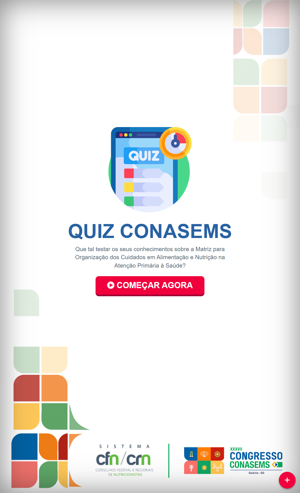

# Sistema de Quiz CONASEMS 2023

 

O Sistema de Quiz CONASEMS 2023 é uma aplicação interativa e educacional desenvolvida para o evento CONASEMS (Conselho Nacional de Secretarias Municipais de Saúde). O objetivo principal deste quiz é promover a conscientização e o conhecimento sobre a importância da nutrição e dos serviços de saúde pública no Brasil.

### Recursos e Funcionalidades

O sistema possui as seguintes características e funcionalidades:

* Perguntas Aleatórias: O quiz exibe perguntas sobre nutrição e saúde pública de forma aleatória para garantir uma experiência variada a cada participante.
* Temporizador: Um temporizador é exibido para os participantes responderem cada pergunta dentro de um tempo específico.
* Feedback Instantâneo: Após cada resposta, o sistema fornece feedback instantâneo indicando se a resposta está correta ou incorreta.
* Contagem de Respostas: O sistema mantém um registro das respostas corretas e incorretas de cada participante.
* Estatísticas Gerais: Ao final do quiz, são exibidas estatísticas gerais, incluindo o número total de perguntas respondidas, respostas corretas e respostas incorretas.
* Estatísticas Individuais: O sistema também apresenta estatísticas individuais para cada pergunta, mostrando o número de respostas corretas e incorretas.
* Download de Resultados: Os participantes têm a opção de baixar um arquivo Excel contendo os resultados do quiz, incluindo as estatísticas gerais e individuais.
* Interface Amigável: A interface do sistema é intuitiva e responsiva, adaptando-se a diferentes dispositivos e oferecendo uma experiência agradável aos usuários.

### Tecnologias Utilizadas

O sistema foi desenvolvido utilizando as seguintes tecnologias:

* HTML5 e CSS3 para a estrutura e estilo da página.
* JavaScript para a lógica de funcionamento do quiz e manipulação dos dados.
* Biblioteca Bootstrap para o layout responsivo e componentes visuais.
* Biblioteca SweetAlert2 para exibir mensagens e alertas.
* Biblioteca lodash.js para operações auxiliares com arrays e objetos.

### Como Executar o Sistema

Para executar o sistema em seu ambiente local, siga as etapas abaixo:

1. Faça o download dos arquivos HTML, CSS e JavaScript do repositório.
2. Certifique-se de ter uma conexão com a internet para acessar as bibliotecas externas utilizadas.
3. Abra o arquivo HTML principal em um navegador da web compatível.
4. O sistema de quiz será exibido e você poderá interagir com ele respondendo as perguntas.

### Considerações Finais

O Sistema de Quiz CONASEMS 2023 é uma ferramenta educacional envolvente que visa promover a conscientização sobre nutrição e saúde pública. Ao oferecer uma experiência interativa e informativa, o sistema contribui para o aprendizado e o compartilhamento de conhecimentos relacionados ao tema.

Esse projeto foi desenvolvido com o intuito de fornecer uma solução simples e eficaz para a realização do quiz durante o evento colaborativo. Esperamos que os participantes desfrutem da experiência e aproveitem a oportunidade de ampliar seus conhecimentos sobre nutrição e saúde pública.

Caso tenha alguma dúvida ou feedback sobre o sistema, sinta-se à vontade para entrar em contato conosco. Agradecemos a participação e o interesse em nosso quiz!